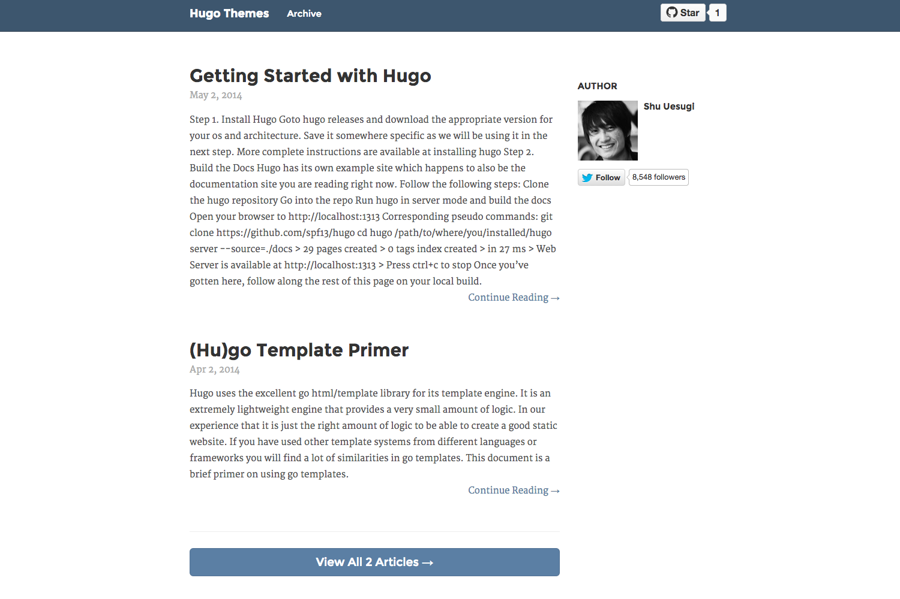

# Shiori

Partial port of [Shiori](http://github.com/ellekasai/shiori) theme to [Hugo](http://gohugo.io).



## Changed from the Original

- To customize the theme, modify Sass files under [static_src](static_src) and run `gulp build`.
- Removed "you can customize this section" messages.
- Removed prev/post navigation on each post (can't be implemented until [this feature](https://github.com/spf13/hugo/issues/319#issuecomment-77797461) is implemented.

## Example Config

```toml
...

title = "Shiori"
author = "Shu Uesugi"

[params]
    author_name = "Shu Uesugi"
    twitter_username = "chibicode"
    gravatar_id = "d747ad92018acd87a77899704fc6693d"
```

## License

[MIT License](LICENSE.md)
